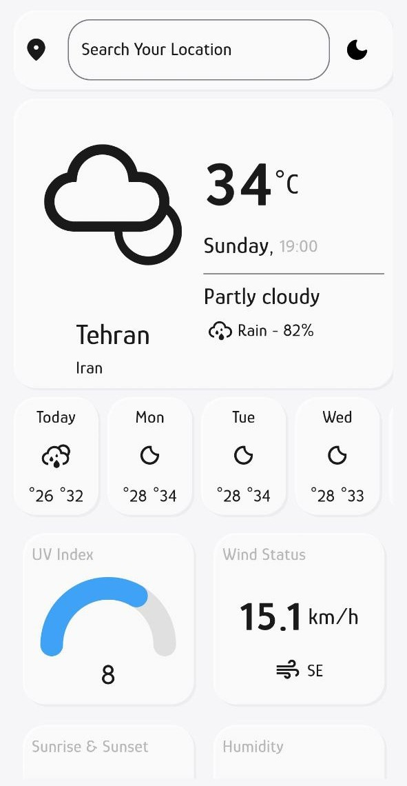

<p align="center">
  
<h1 style="text-align:center">Cloud</h1>
</p>


Simple Weather app
in this app you can search and see uv,wind status, humidity... and 14 days forecast, thank to [WeatherApi](https://www.weatherapi.com/)


## Getting Started
1. run `flutter pub get` to get packages
2. `flutter tun`


### How to use:
1. run `flutter pub get` to get packages
2. run `flutter packages pub run build_runner build`

### Folder Structure (lib) :
```
├───Core
│   ├───constants
│   ├───data
│   ├───services
│   ├───themes
│   └───widgets
├───Features
│   ├───forecast
│   ├───home
│   │   └───widgets
│   └───splash
└───gen
```
### App preview:
